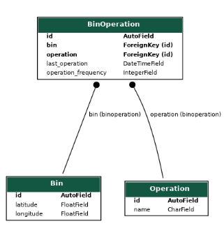

# Django

## WorkShop 1

- Getting navigation record data send by vehicles in last 48 hours sorted by time <br>
Link - http://127.0.0.1:8000/navigation/

<u>Suggestion</u> -> User stored - Redis cache can be used.

Sample Output
```
[
 {
  "latitude": 25.43,
  "longitude": 34.53,
  "plate": "34HZ3421",
  "datetime": "21.03.2021 16:12:29"
 },
 {
  "latitude": 5.0,
  "longitude": 5.0,
  "plate": "34HZ3422",
  "datetime": "21.03.2021 15:52:20"
 }
]
```

## Workshop 2
- Design database model and return list of collection_frequency. <br>
Link - http://127.0.0.1:8000/bins/

Sample Output
```
[
 {
  "operation_name": "Test Operation",
  "frequency": 1,
  "latitude": 5.4,
  "longitude": 4.5
 }
]
```

<u>ER Diagram</u>


<br>
<br>

## How To Run

- Go to folder which contains manage.py (Base Folder)
- Migrate to data and populate to database; <br>

```python manage.py migrate``` <br>
```python manage.py makemigrations```

Run server with using ;

```python manage.py runserver```